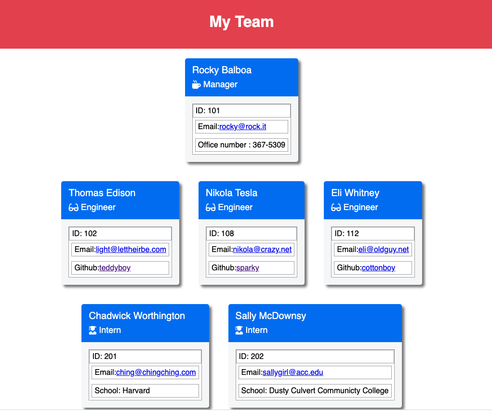

# **Bryan Godwin - Week 10 Challenge**

## **Team Profile Generator**

### This challenge is to build a node.js application that takes information about employees on a software engineering team and generates an html webpage that displays summaries for each person.

### **User Story**

    AS A manager
    I WANT to generate a webpage that displays my team's basic info
    SO THAT I have quick access to their emails and GitHub profiles

### **Acceptance Critera**

1.  Automatically generate HTML & CSS for a team roster

        WHEN I am prompted for my team members and their information
        THEN an HTML file is generated that displays a nicely formatted team roster based on user input

2.  Emails are clickable links

        WHEN I click on an email address in the HTML
        THEN my default email program opens and populates the TO field of the email with the address

3.  Github links open the github page in a new tab

        WHEN I click on the GitHub username
        THEN that GitHub profile opens in a new tab

4.  Team is entered when the program starts

        WHEN I start the application
        THEN I am prompted to enter the team manager’s name, employee ID, email address, and office number

5.  Enter other team members after the manager is entered

        WHEN I enter the team manager’s name, employee ID, email address, and office number
        THEN I am presented with a menu with the option to add an engineer or an intern or to finish building my team

6.  Collect specific data for engineers

        WHEN I select the engineer option
        THEN I am prompted to enter the engineer’s name, ID, email, and GitHub username, and I am taken back to the menu

7.  Collect specific data for interns

        WHEN I select the intern option
        THEN I am prompted to enter the intern’s name, ID, email, and school, and I am taken back to the menu

8.  The HTML & CSS is generated after the team is entered

        WHEN I decide to finish building my team
        THEN I exit the application, and the HTML is generated

### **Notes**

The HTML and CSS output is put in the "/docs" directory (instead of the normally expected "/dist" directory) so that the final HTML output file can be shown on the Github pages link.

### **Challenge Ten - code repository**

<https://github.com/godwinbw/team-profile-generator>

### **Challenge Ten - html output file**

<https://godwinbw.github.io/team-profile-generator/>

### **Challenge Ten - screenshot**

### **Challenge Ten - demo video**

This is a streamable link

<https://streamable.com/gznb4r>

The video file is also in the repo

<https://github.com/godwinbw/team-profile-generator/demo-video.mp4>
